<p align="center">
  
  
  
  
  
  
  
</p>

<h1 align="center">Ethical Insight Pro</h1>

<p align="center">
  <strong>AI-Powered Ethical Decision-Making Analyzer for Occupational Health &amp; Safety Professionals</strong>
</p>

<p align="center">
  A companion application for the Wiley textbook<br/>
  <em>"Ethical Decision-making in Occupational and Environmental Health and Safety:<br/>A Comparative Case Study Approach"</em> (© 2026, John Wiley &amp; Sons)
</p>

---

## Table of Contents

- [Overview](#overview)
- [Problem Statement](#problem-statement)
- [Core Features](#core-features)
- [System Architecture](#system-architecture)
- [User Journey](#user-journey)
- [AI Analysis Pipeline](#ai-analysis-pipeline)
- [Scoring Algorithm](#scoring-algorithm)
- [Database Schema](#database-schema)
- [Tech Stack](#tech-stack)
- [Project Structure](#project-structure)
- [Getting Started](#getting-started)
- [Environment Variables](#environment-variables)
- [Professional Codes of Conduct](#professional-codes-of-conduct)
- [Six Ethical Lenses](#six-ethical-lenses)
- [Security & Privacy](#security--privacy)
- [License](#license)

---

## Overview

**Ethical Insight Pro** provides OHS professionals -- safety engineers, industrial hygienists, occupational health nurses, and OHS physicians -- with a structured, AI-powered analytical framework for evaluating ethical dilemmas. The platform analyzes cases through **six ethical lenses**, cross-references **four professional codes of conduct**, and generates comprehensive, non-prescriptive analysis reports with composite scoring, conflict detection, and reflection prompts.

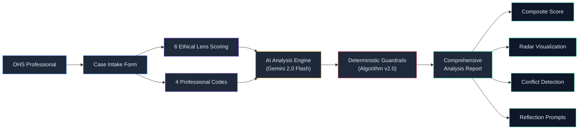

---

## Problem Statement

OHS professionals regularly face complex ethical dilemmas where professional obligations, stakeholder interests, and theoretical ethical frameworks may conflict. Traditional approaches rely on subjective judgment without structured analytical support.

**Ethical Insight Pro bridges this gap by:**

| Challenge | Solution |
|:----------|:---------|
| Unstructured ethical reasoning | Guided analysis through 6 ethical lenses |
| Inconsistent code compliance checks | Automated cross-referencing of 4 professional codes |
| Subjective scoring | Deterministic 70/30 weighted algorithm with guardrails |
| AI hallucination risk | AI provides reasoning only; all scores are computed deterministically |
| Prescriptive bias | Non-advisory language enforced at the AI prompt level |

---

## Core Features

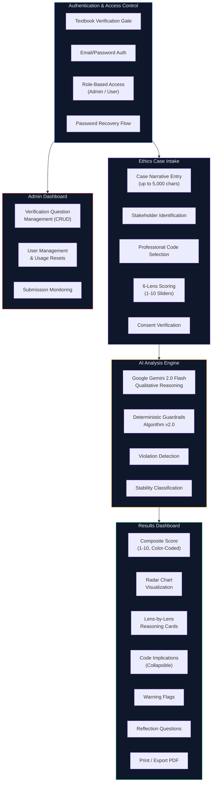

### Feature Highlights

- **Textbook Verification Gate** -- Users must answer an admin-configured knowledge question from the textbook before registration, ensuring access is limited to legitimate textbook owners.

- **Structured Case Intake** -- Guided form collecting case title, narrative (up to 5,000 characters), stakeholders, applicable professional codes, and user-rated ethical lens scores via intuitive sliders.

- **AI-Powered Qualitative Analysis** -- Google Gemini 2.0 Flash generates nuanced reasoning for each ethical lens and professional code, constrained to analytical (never prescriptive) language.

- **Deterministic Scoring with Guardrails** -- All numeric scores, stability classifications, and conflict levels are computed by Algorithm v2.0 -- the AI never generates scores, eliminating hallucination risk.

- **Comprehensive Results Dashboard** -- Composite score display, interactive radar chart, lens-by-lens reasoning cards, collapsible code implications, violation warnings, analytical observations, and reflection questions.

- **Usage Limits & Admin Controls** -- Configurable per-user analysis limits (default: 5), admin-managed verification questions, user management, and submission monitoring.

---

## System Architecture

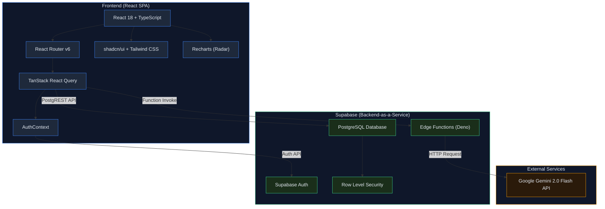

---

## User Journey

### New User Registration

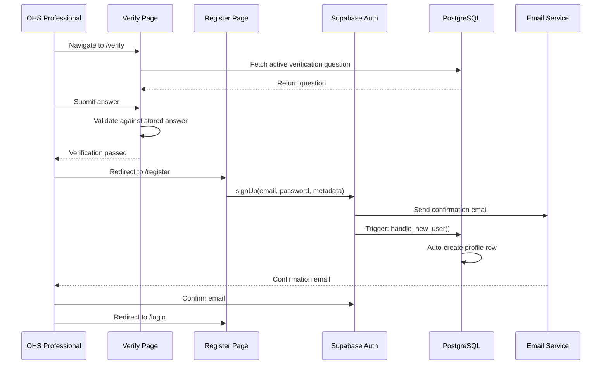

### Case Analysis Flow

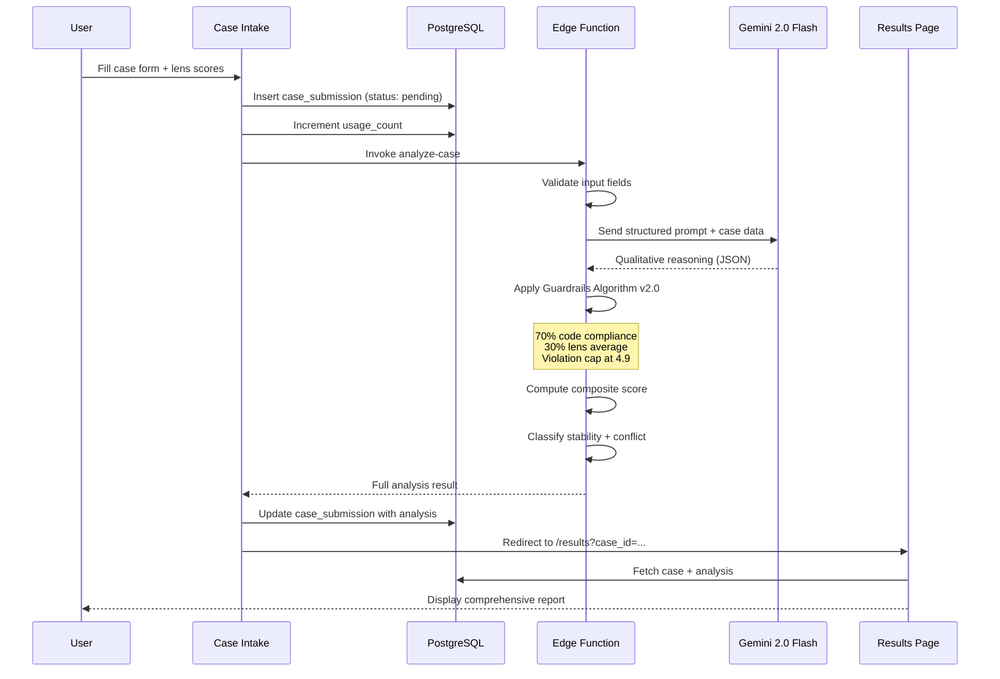

### Admin Workflow

```mermaid
sequenceDiagram
    participant A as Admin
    participant AD as Admin Dashboard
    participant DB as PostgreSQL

    A->>AD: Login with admin credentials
    AD->>DB: Verify admin role (has_role RPC)
    DB-->>AD: Confirmed admin

    rect rgb(15, 23, 42)
        Note over AD,DB: Verification Questions Management
        AD->>DB: CRUD verification questions
        AD->>DB: Toggle question active/inactive
    end

    rect rgb(15, 23, 42)
        Note over AD,DB: User Management
        AD->>DB: Fetch all profiles + usage stats
        AD->>DB: Reset user usage counts
    end

    rect rgb(15, 23, 42)
        Note over AD,DB: Submission Monitoring
        AD->>DB: Fetch recent case submissions
        AD-->>A: Display status + timestamps
    end
```

---

## AI Analysis Pipeline

```mermaid
graph TB
    INPUT["Case Data Input"] --> VALIDATE["Input Validation"]
    VALIDATE --> PROMPT["Construct AI Prompt"]

    subgraph PROMPT_CTX["Prompt Context"]
        L1["6 Ethical Lens Definitions"]
        L2["4 Professional Code Knowledge"]
        L3["Violation Detection Rules"]
        L4["Non-Advisory Language Constraints"]
    end

    PROMPT --> PROMPT_CTX
    PROMPT_CTX --> GEMINI["Gemini 2.0 Flash API Call"]
    GEMINI --> RAW["Raw AI Response<br/>(Qualitative Reasoning Only)"]
    RAW --> GUARD["Deterministic Guardrails"]

    subgraph GUARD_DETAIL["Algorithm v2.0 Guardrails"]
        G1["Use user-provided lens scores directly"]
        G2["Compute code compliance from violations:<br/>9 (none) / 6 (tension) / 3 (single) / 1 (multi)"]
        G3["Composite = 70% code + 30% lens avg"]
        G4["If violation detected: cap at 4.9"]
        G5["Stability = f(std deviation, violations)"]
        G6["Conflict level 1-3"]
    end

    GUARD --> GUARD_DETAIL
    GUARD_DETAIL --> OUTPUT["Structured Analysis JSON<br/>_guardrailsApplied: true<br/>_algorithmVersion: 2.0"]

    style INPUT fill:#1e293b,stroke:#3b82f6,color:#e2e8f0
    style VALIDATE fill:#1e293b,stroke:#3b82f6,color:#e2e8f0
    style PROMPT fill:#1e293b,stroke:#8b5cf6,color:#e2e8f0
    style PROMPT_CTX fill:#0f172a,stroke:#8b5cf6,color:#e2e8f0
    style GEMINI fill:#1e293b,stroke:#f59e0b,color:#e2e8f0
    style RAW fill:#1e293b,stroke:#f59e0b,color:#e2e8f0
    style GUARD fill:#1e293b,stroke:#ef4444,color:#e2e8f0
    style GUARD_DETAIL fill:#0f172a,stroke:#ef4444,color:#e2e8f0
    style OUTPUT fill:#1e293b,stroke:#10b981,color:#e2e8f0
```

---

## Scoring Algorithm

The **Algorithm v2.0** scoring system ensures deterministic, reproducible results:

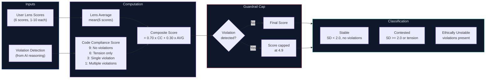

| Weight | Component | Description |
|:------:|:----------|:------------|
| **70%** | Code Compliance | Weighted heavily -- professional obligations are paramount |
| **30%** | Lens Average | Ethical theory alignment provides supporting context |
| **Cap** | Violation Override | Any detected violation caps composite at **4.9/10** maximum |

---

## Database Schema

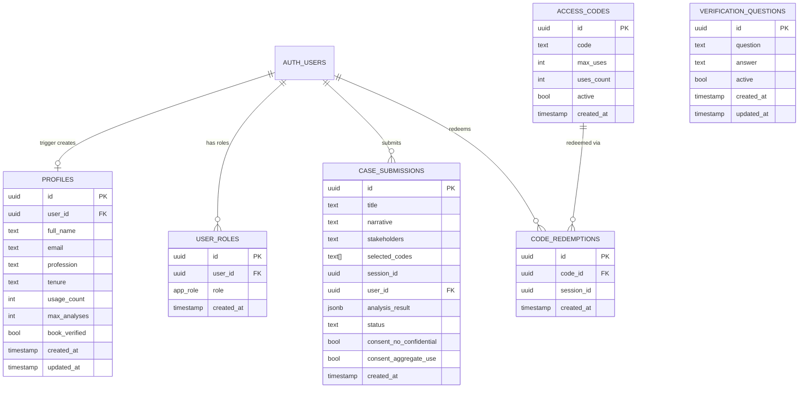

**Row Level Security (RLS)** is enforced on all tables:
- Users can only read and update their own profile and submissions
- Admins have full access via the `has_role()` security-definer function
- Verification questions are publicly readable (active only); admin-managed
- All mutations require authentication

---

## Tech Stack

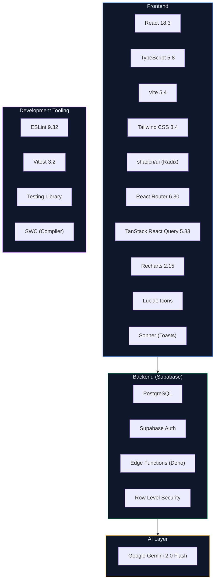

| Category | Technologies |
|:---------|:-------------|
| **Frontend** | React 18.3, TypeScript 5.8, Vite 5.4 (SWC), Tailwind CSS 3.4 |
| **UI Components** | shadcn/ui (Radix UI primitives), Lucide Icons, Sonner |
| **State & Routing** | React Router 6.30, TanStack React Query 5.83, React Context |
| **Visualization** | Recharts 2.15 (Radar Chart) |
| **Backend** | Supabase (PostgreSQL, Auth, Edge Functions, RLS) |
| **AI Engine** | Google Gemini 2.0 Flash (via Deno Edge Function) |
| **Forms & Validation** | React Hook Form 7.61, Zod 3.25 |
| **Testing** | Vitest 3.2, Testing Library (React 16, jest-dom 6) |
| **Linting** | ESLint 9.32, TypeScript ESLint |

---

## Project Structure

```
ethical-insight-pro/
├── docs/                           # Extended documentation
│   └── README.md                   # Detailed project documentation
├── public/                         # Static assets
├── src/
│   ├── components/
│   │   ├── layout/
│   │   │   ├── Header.tsx          # Landing & page header variants
│   │   │   └── Footer.tsx          # Copyright & privacy footer
│   │   ├── results/
│   │   │   ├── ResultsHeader.tsx   # Composite score & case metadata
│   │   │   ├── ConflictAlert.tsx   # Conflict level warning banner
│   │   │   ├── LensCard.tsx        # Individual lens score + reasoning
│   │   │   ├── LensRadarChart.tsx  # 6-axis radar visualization
│   │   │   ├── CodeImplications.tsx# Professional code analysis
│   │   │   ├── RecommendationsSection.tsx # Observations & reflections
│   │   │   ├── WarningFlags.tsx    # Violation warning display
│   │   │   └── ResultsFooterActions.tsx  # Print/PDF & navigation
│   │   ├── ui/                     # shadcn/ui component library
│   │   └── NavLink.tsx             # Navigation link component
│   ├── contexts/
│   │   └── AuthContext.tsx         # Authentication state management
│   ├── hooks/
│   │   ├── use-mobile.tsx          # Responsive breakpoint hook
│   │   └── use-toast.ts           # Toast notification hook
│   ├── integrations/
│   │   └── supabase/
│   │       ├── client.ts           # Supabase client initialization
│   │       └── types.ts            # Generated database type definitions
│   ├── lib/
│   │   └── utils.ts                # Utility functions (cn, etc.)
│   ├── pages/
│   │   ├── Index.tsx               # Landing page
│   │   ├── Verify.tsx              # Textbook verification gate
│   │   ├── Register.tsx            # User registration
│   │   ├── Login.tsx               # User login
│   │   ├── ForgotPassword.tsx      # Password recovery request
│   │   ├── ResetPassword.tsx       # Password reset form
│   │   ├── CaseIntake.tsx          # Ethics case submission form
│   │   ├── Results.tsx             # Analysis results dashboard
│   │   ├── Admin.tsx               # Admin management dashboard
│   │   ├── About.tsx               # About & attribution page
│   │   └── NotFound.tsx            # 404 page
│   ├── services/
│   │   ├── aiAnalysis.ts           # AI analysis service & types
│   │   └── database.ts             # Database CRUD operations
│   ├── test/                       # Test utilities & setup
│   ├── App.tsx                     # Root component & routing
│   ├── App.css                     # Application styles
│   ├── index.css                   # Global styles & CSS variables
│   └── main.tsx                    # Application entry point
├── supabase/
│   ├── functions/
│   │   └── analyze-case/
│   │       └── index.ts            # Deno Edge Function (AI + Guardrails)
│   ├── migrations/                 # SQL migration files (6 migrations)
│   └── config.toml                 # Supabase project configuration
├── package.json
├── vite.config.ts
├── tailwind.config.ts
├── tsconfig.json
└── vitest.config.ts
```

---

## Getting Started

### Prerequisites

- **Node.js** >= 18.x
- **npm** >= 9.x
- A **Supabase** project with Auth, Database, and Edge Functions enabled
- A **Google Gemini API key** (for the AI analysis edge function)

### Installation

```bash
# Clone the repository
git clone https://github.com/the-ai-entrepreneur-ai-hub/ethical-insight-pro.git

# Navigate to the project directory
cd ethical-insight-pro

# Install dependencies
npm install

# Start the development server
npm run dev
```

### Available Scripts

| Command | Description |
|:--------|:------------|
| `npm run dev` | Start development server (port 8080) |
| `npm run build` | Production build |
| `npm run build:dev` | Development build |
| `npm run lint` | Run ESLint |
| `npm run preview` | Preview production build |
| `npm run test` | Run tests (Vitest) |
| `npm run test:watch` | Run tests in watch mode |

---

## Environment Variables

| Variable | Description |
|:---------|:------------|
| `VITE_SUPABASE_URL` | Supabase project URL |
| `VITE_SUPABASE_ANON_KEY` | Supabase anonymous/public key |
| `GEMINI_API_KEY` | Google Gemini API key (Edge Function secret) |

---

## Professional Codes of Conduct

The platform evaluates cases against four recognized OHS professional codes:

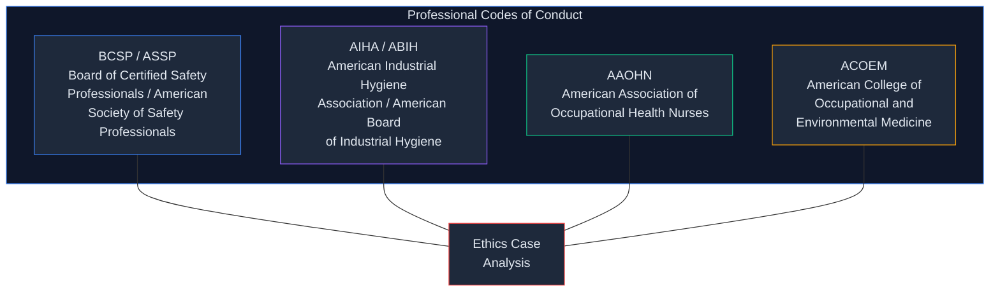

---

## Six Ethical Lenses

Each case is evaluated through six distinct ethical frameworks:

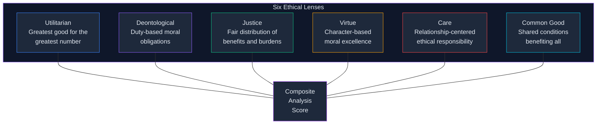

Users rate each lens (1-10) based on their professional assessment. These scores feed directly into the deterministic Algorithm v2.0 -- the AI never modifies or overrides user-provided lens scores.

---

## Security & Privacy

| Concern | Safeguard |
|:--------|:----------|
| **Data Access** | Row Level Security (RLS) on all database tables |
| **Authentication** | Supabase Auth with email confirmation and session management |
| **Admin Isolation** | `has_role()` SECURITY DEFINER function for admin-only operations |
| **AI Score Integrity** | Deterministic guardrails prevent AI from generating or altering numeric scores |
| **Textbook Access Gate** | Verification question must be answered before registration |
| **Consent** | Dual consent checkboxes required before case submission |
| **No Confidential Data** | Users explicitly confirm no confidential information is included |
| **Non-Prescriptive Output** | AI is constrained to analytical language -- never "should", "must", or "recommended" |
| **Usage Limits** | Configurable per-user analysis caps (default: 5) prevent abuse |

---

## License

This project is a companion application for *"Ethical Decision-making in Occupational and Environmental Health and Safety: A Comparative Case Study Approach"* (copyright 2026, John Wiley & Sons). All rights reserved.

---

<p align="center">
  <strong>Ethical Insight Pro</strong> -- Structured ethical analysis for OHS professionals
</p>
